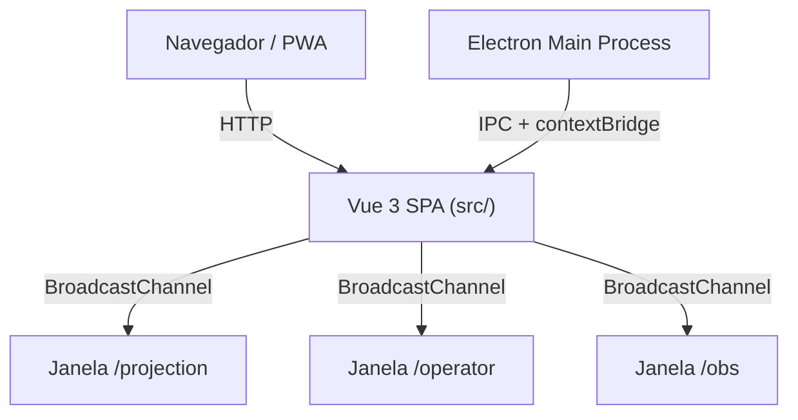
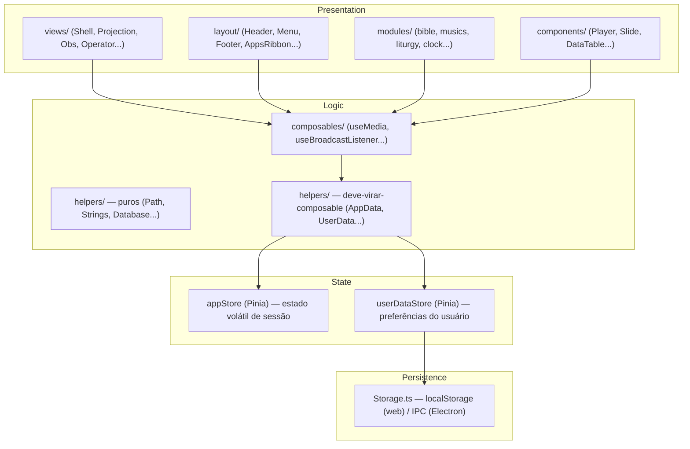
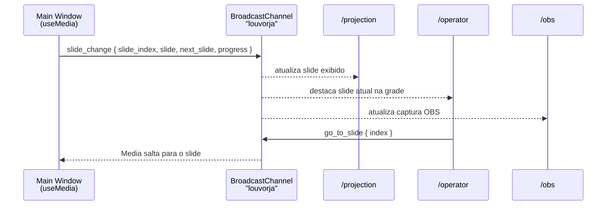
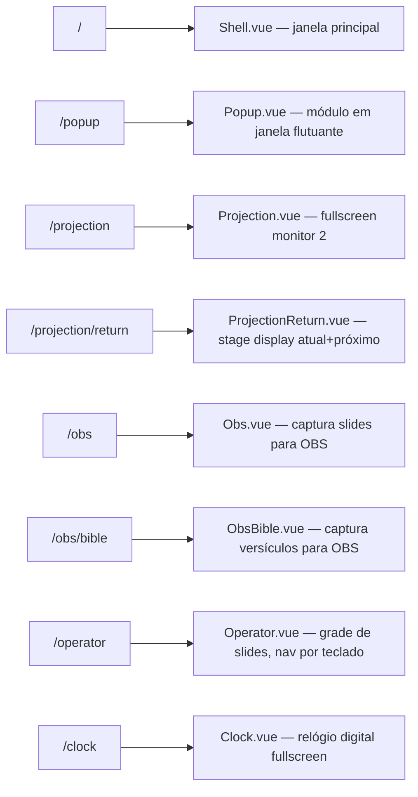

# Arquitetura do LouvorJA

Documento de referência para o sistema Vue 3 do LouvorJA. Descreve camadas, fluxo de dados, padrões e decisões estruturais do código atual. Para roadmap futuro e migração Delphi→Vue, veja [CLAUDE.md](CLAUDE.md). Para decisões arquiteturais formalizadas, veja [docs/adr/](docs/adr/).

---

## Visão Geral

LouvorJA é uma SPA (Single-Page Application) Vue 3 que roda tanto como **PWA web** quanto como **app desktop Electron**. O mesmo código-fonte serve os dois targets; a diferença de comportamento é isolada em [`src/helpers/Platform.js`](src/helpers/Platform.js).



---

## Stack

| Camada | Tecnologia | Versão | Nota |
|---|---|---|---|
| UI Framework | Vue 3 | ^3.x | Composition API + `<script setup>` |
| Componentes visuais | Vuetify 4 | ~4.0.6 | Travado — ver [ADR 0001](docs/adr/0001-vuetify-versao-estavel.md) |
| Estado global | Pinia | ^2.x | Substitui Vuex — ver tasks #003 e #004 |
| Roteamento | Vue Router | 5.x | Travado — ver [ADR 0002](docs/adr/0002-vue-router-version.md) |
| Internacionalização | Vue I18n | ^11.x | PT/ES |
| Build | Vite | ^7.x | manualChunks, aliases `@`, `@helpers`, `@modules` |
| Testes unitários | Vitest | — | Cobertura de helpers críticos |
| Testes E2E | Playwright | — | Smoke Operator→Projection |
| Desktop | Electron | — | Roadmap D0–D10 |

---

## Camadas e Responsabilidades



### Regra de dependência

- **Views e componentes** importam composables; raramente importam helpers diretamente.
- **Composables** podem importar helpers (puros ou acoplados) e outros composables.
- **Helpers puros** não importam nada do Vue — seguros no Electron main process e em testes Node puro.
- **Helpers `deve-virar-composable`** acessam Pinia e só funcionam no renderer (com Pinia inicializado).
- **Stores Pinia** não importam helpers — apenas definem estado e actions.

---

## Estado Global

O estado do app é gerenciado em três camadas sobrepostas:

```
Storage.ts          ← persistência (localStorage / Electron IPC)
    ↑
UserData.ts         ← preferências do usuário (tema, idioma, favoritos...)
    ↑
AppData.ts          ← estado de sessão (módulos abertos, flags de UI...)
    ↑
Composables/Views   ← consomem via AppData.get/set ou diretamente Pinia
```

### Storage.ts

Único ponto de leitura/escrita em disco. Sem lógica de negócio.

- `type="local"` → `localStorage` (web) ou cache em memória sincronizado com `userData/storage/` via IPC (Electron).
- `type="session"` → `sessionStorage` (ambos os targets).

Chamadores autorizados: `UserData.ts`, `Database.ts`, `main.js` (apenas `hydrate()`).

### AppData.ts

Camada de acesso a ambos os stores Pinia usando notação de ponto (`dot-notation`). Evita que componentes importem stores diretamente.

```js
AppData.get("user_data.theme")      // lê userDataStore
AppData.set("modules.media.show", true) // escreve appStore
```

Toda escrita via `set()` é propagada à janela popup aberta via `window.postMessage`, mantendo estado sincronizado.

### UserData.ts

Preferências persistidas do usuário. Lê/escreve via `AppData` → `userDataStore` → `Storage` (com debounce de 300 ms para evitar writes excessivos).

```js
UserData.get("theme")        // → appStore.user_data.theme
UserData.set("theme", "dark") // persiste automaticamente
```

### Stores Pinia

| Store | Arquivo | Conteúdo |
|---|---|---|
| `app` | `src/stores/appStore.js` | Flags (`is_dark`, `is_dev`, `is_popup`), módulos abertos, alertas, popup ref |
| `userData` | `src/stores/userDataStore.js` | `theme`, `language`, `layout`, `remote`, `modules.*` |

Componentes e módulos **não importam as stores diretamente** — usam `AppData`/`UserData` ou composables que encapsulam o acesso.

---

## Helpers vs Composables

A distinção é de **contrato de uso**:

| | Helper puro | Deve-virar-composable | Composable |
|---|---|---|---|
| Localização | `src/helpers/` | `src/helpers/` | `src/composables/` |
| APIs Vue | Nenhuma | `watch`, Pinia | `ref`, `computed`, lifecycle |
| Chamável em | Qualquer contexto | Só no renderer | Só dentro de `setup()` |
| Retorna | Funções / objeto | Funções / objeto | Estado reativo + cleanup |
| Testável com | Node puro | Requer Pinia mock | Requer `@vue/test-utils` |

### Helpers puros (13)

`DateTime`, `Strings`, `ModuleTypes`, `Platform`, `SljaConverter`, `AudioBeep`, `Hotkeys`, `Shortcuts`, `BroadcastTypes`, `Broadcast`, `Path`, `Database`, `Storage`

Restrição crítica: `Path.ts`, `Storage.ts`, `Platform.js` são usados no Electron main process — **nunca** adicionar dependências de Vue ou Pinia a esses arquivos.

### Helpers deve-virar-composable (11)

`AppData`, `UserData`, `Modules`, `ModuleManager`, `Favorites`, `History`, `Liturgy`, `Dev`, `Alert`, `Popup`, `CommandRegistry`

São candidatos a migração para composables quando a camada de estado for estabilizada. Enquanto isso, funcionam apenas no renderer (onde Pinia está inicializado).

### Composables existentes (12)

| Composable | Responsabilidade |
|---|---|
| `useMedia` | Player de mídia — áudio + slides + broadcast. Singleton de módulo. |
| `useAudioPlayback` | Wrapper do `<audio>` com estado reativo (isPaused, progress, buffered). |
| `useSlides` | Estado dos slides (slideIndex, totalSlides, slideProgress). |
| `useLyric` | Carrega e normaliza dados de letras/cifras do banco. |
| `useAlbum` | Estado do álbum em reprodução (faixas, índice atual). |
| `usePlayerState` | Estado derivado do player para leitura rápida por componentes. |
| `useBroadcastListener` | Subscribe ao BroadcastChannel com cleanup automático em `onUnmounted`. |
| `useBroadcastSender` | Envia mensagens ao BroadcastChannel. |
| `useProjectionState` | Estado da janela de projeção (slide atual, próximo, progresso). |
| `useShell` | Singleton do shell (abre CommandPalette, HotkeysCheatsheet). |
| `useModule` | Helpers de ciclo de vida de módulo (abrir, fechar, minimizar). |
| `useDisplays` | Gerencia telas físicas disponíveis (Electron D4). |

---

## Módulos

Cada módulo em `src/modules/<id>/` é autocontido:

```
<id>/
├── manifest.json        # Metadados (id, name, icon, category, dependencies)
├── index.js             # Registra mensagens i18n e configurações do módulo
├── interface/           # Componente principal renderizado na janela do módulo
│   └── Index.vue
├── components/          # Componentes internos do módulo
└── lang/                # Traduções do módulo (pt.json, es.json)
    ├── pt.json
    └── es.json
```

`manifest.json` é validado contra um JSON Schema na build (task #014). Chaves de i18n ficam em `modules.<id>.<key>`.

O `ModuleManager` registra todos os módulos no boot lendo os `manifest.json`. O `Modules.js` controla abrir/fechar/minimizar em runtime, escrevendo no `appStore` (via `AppData`).

Decisão sobre `modules/core/`: achatado — ver [ADR 0003](docs/adr/0003-modules-core-flat.md).

---

## Comunicação Entre Janelas

Janelas abertas via `window.open()` (projeção, operador, OBS) se comunicam com a janela principal via `BroadcastChannel("louvorja")`.



### Tipos de mensagem (contratos em `BroadcastTypes.ts`)

| Tipo | Emitido por | Recebido por |
|---|---|---|
| `slide_change` | `useMedia` | Projection, ProjectionReturn, Obs, Operator |
| `slides_data` | `useMedia` (open) | Operator |
| `go_to_slide` | Operator.vue | `useMedia` |
| `bible_verse` | bible/Index.vue | ObsBible |
| `message_board` | message_board/Index.vue | (futuro) |
| `module:refresh` | Hotkeys (F5/F9) | Módulo ativo |
| `module:focus_search` | Hotkeys (Ctrl+F) | Módulo ativo |
| `media:prev_music` / `media:next_music` | Hotkeys | Módulo de álbum/liturgia |
| `liturgy:new_item` / `liturgy:new_annotation` | Hotkeys | Módulo liturgy |
| `drawing_number` / `drawing_name` | HTTP externo (D5) | Módulos draw/name_draw |

Em componentes Vue, use `useBroadcastListener` (com cleanup automático) em vez de `Broadcast.listen` diretamente.

> **Limitação Electron**: `BroadcastChannel` não cruza processos Electron nativamente. A solução para D4+ está documentada em task #116.

---

## Rotas



Todas as rotas exceto `/` e `/popup` são carregadas via lazy import (`() => import(...)`). Popup e projeção são abertas via `window.open()` — não via `router.push()`.

---

## Atalhos de Teclado

Dois sistemas coexistem:

| Sistema | Arquivo | Escopo | Quando usar |
|---|---|---|---|
| `Hotkeys.js` | `src/helpers/Hotkeys.js` | In-window (keydown) | Navegação de slides, módulos, Command Palette |
| `Shortcuts.js` | `src/helpers/Shortcuts.js` | OS-level (Electron `globalShortcut`) | Atalhos que funcionam mesmo sem foco na janela |

No web/PWA, `Shortcuts` é no-op. Os atalhos são registrados em `main.js` após o mount do app.

Atalhos globais documentados: `F1` (cheatsheet), `F5/F9` (refresh), `Ctrl+K` (Command Palette), `Ctrl+F` (busca), `Esc/Ctrl+W` (fechar módulo), setas (navegação de slides quando media ativa), `Space/Pause` (play/pause).

---

## Banco de Dados

Dados são arquivos JSON servidos pelo backend configurado via variáveis de ambiente:

```
VITE_URL_DATABASE=https://api.louvorja.com.br/json_db
VITE_URL_FILES=https://...
VITE_API_TOKEN=...
```

`Database.ts` gerencia o carregamento com cache em `sessionStorage` (web) ou `userData/json_db/` (Electron D2). Chamadores usam apenas:

```js
import $database from "@/helpers/Database";
const musics = await $database.get("pt_musics");
```

---

## Build e Bundling

Vite 7 com `manualChunks` explícito (task #062) para separar vendor chunks e evitar bundle monolítico:

- `vendor-vue`: Vue 3 + Vue Router + Pinia + Vue I18n
- `vendor-vuetify`: Vuetify 4 + Material Design Icons
- `vendor-misc`: bibliotecas de suporte

Aliases configurados em `vite.config.js`:

| Alias | Resolve para |
|---|---|
| `@` | `src/` |
| `@helpers` | `src/helpers/` |
| `@modules` | `src/modules/` |
| `@components` | `src/components/` |

---

## Adapter Web/Desktop (Platform.js)

```js
// src/helpers/Platform.js
export default {
  isDesktop: typeof window !== "undefined" && !!window.louvorjaApi,
  api: typeof window !== "undefined" ? window.louvorjaApi : null,
  // + protocol, download, onHttpEvent...
};
```

`window.louvorjaApi` é exposto pelo `preload.cjs` via `contextBridge`. Helpers que têm comportamento diferente entre web e desktop verificam `Platform.isDesktop` e delegam para `window.louvorjaApi.*` quando em Electron.

---

## Internacionalização

Dois níveis de traduções, ambos carregados por `createI18nInstance()`:

1. **Global** — `src/lang/pt.json` e `src/lang/es.json` (strings compartilhadas: alertas, shell, atalhos).
2. **Por módulo** — `src/modules/<id>/lang/pt.json` e `es.json`. Registradas pelo `index.js` do módulo. Chave raiz: `modules.<id>.<key>`.

Idioma padrão: `pt`. Fallback automático para `pt` se a chave não existir em `es`.

---

## Fluxo de Boot

```mermaid
sequenceDiagram
    participant main as main.js
    participant storage as Storage.hydrate()
    participant platform as Platform
    participant i18n as createI18nInstance
    participant mm as ModuleManager.init
    participant app as app.mount()
    participant hk as Hotkeys.init()

    main->>storage: aguarda hidratação (no-op no web)
    storage-->>main: ok
    main->>platform: configura protocolo + downloader (Electron)
    main->>main: Shortcuts.init()
    main->>i18n: carrega traduções globais + módulos
    i18n-->>main: instância i18n
    main->>mm: registra módulos (manifests)
    main->>app: monta o Vue app
    app-->>main: montado
    main->>main: Liturgy.migrate() (one-time, no-op se sem dados legados)
    main->>hk: Hotkeys.init() + registra todos os atalhos
```



---

## Referências

- [CLAUDE.md](CLAUDE.md) — Convenções de módulos, estado global, roadmap Electron
- [CONTRIBUTING.md](CONTRIBUTING.md) — Guia de contribuição e criação de módulos
- [docs/adr/0001-vuetify-versao-estavel.md](docs/adr/0001-vuetify-versao-estavel.md) — Vuetify travado em ~4.0.6
- [docs/adr/0002-vue-router-version.md](docs/adr/0002-vue-router-version.md) — Vue Router 5
- [docs/adr/0003-modules-core-flat.md](docs/adr/0003-modules-core-flat.md) — Sem diretório `modules/core/`
- [src/helpers/BroadcastTypes.ts](src/helpers/BroadcastTypes.ts) — Contratos e payloads do BroadcastChannel
