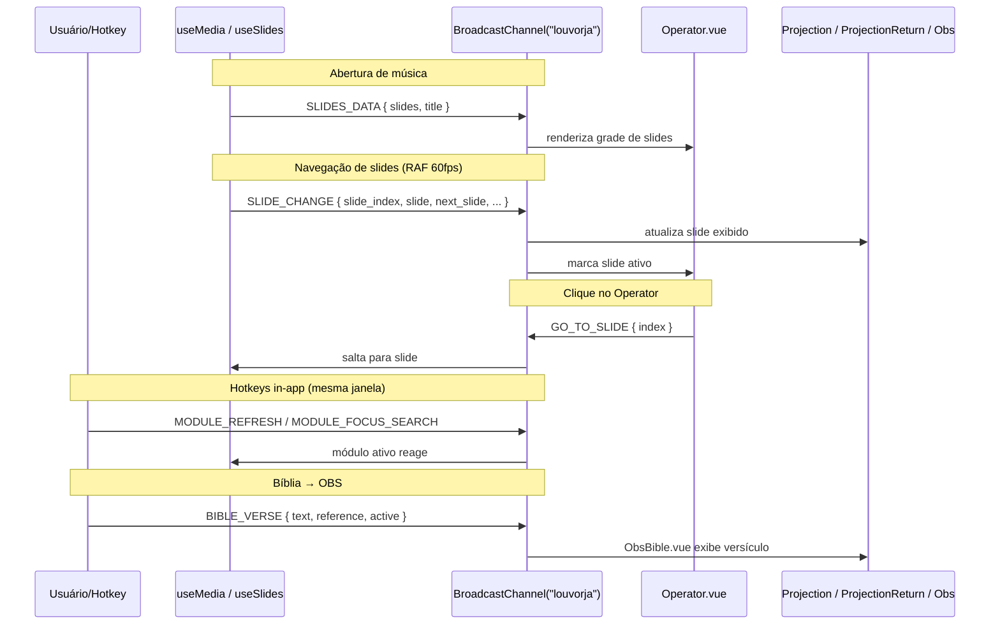

# BroadcastChannel — Schemas e Fluxos

Canal `BroadcastChannel("louvorja")` — comunicação entre janelas e componentes.

---

## Visão Geral

O LouvorJA usa um único canal `BroadcastChannel("louvorja")` para duas finalidades distintas:

| Categoria | Descrição | Escopo |
|---|---|---|
| **cross-window** | Sincronizam estado entre janelas abertas (Projeção, Operador, OBS) | Multi-janela / multi-aba (mesmo origin) |
| **in-app** | Hotkeys e eventos HTTP traduzidos em mensagens para módulos Vue | Mesma janela |

> ✅ **Electron**: `BroadcastChannel` **funciona entre janelas** (`BrowserWindow` distintas) no Electron 41+.
> Requisitos já satisfeitos no código: todas as janelas usam `sandbox: false` em `webPreferences`
> (obrigatório), mesma origem em dev (`http://localhost:5002`) e prod (`file://`),
> e a mesma partition padrão. Não é necessário bridge IPC. Ver task #116.

---

## Como Usar

### Ouvir mensagens em componentes Vue (`<script setup>`)

```js
import { useBroadcastListener } from "@/composables/useBroadcastListener";
import { BROADCAST_TYPE } from "@/helpers/BroadcastTypes";

// Listener removido automaticamente no onUnmounted — sem memory leak.
useBroadcastListener(BROADCAST_TYPE.SLIDE_CHANGE, (payload) => {
  console.log(payload.slide_index, payload.slide);
});

// Ouvir múltiplos tipos de uma vez
useBroadcastListener(
  [BROADCAST_TYPE.SLIDES_DATA, BROADCAST_TYPE.SLIDE_CHANGE],
  (payload, msg) => {
    if (msg.type === BROADCAST_TYPE.SLIDES_DATA) { /* ... */ }
  }
);

// Ouvir tudo (debug)
useBroadcastListener("*", (payload, msg) => console.log(msg.type, payload));
```

### Enviar mensagens

```js
import { useBroadcastSender } from "@/composables/useBroadcastSender";

const { send, BROADCAST_TYPE } = useBroadcastSender();
send(BROADCAST_TYPE.GO_TO_SLIDE, { index: 3 });
```

```js
// Em helpers / composables fora do contexto Vue:
import $broadcast, { BROADCAST_TYPE } from "@/helpers/Broadcast";

$broadcast.send(BROADCAST_TYPE.SLIDE_CHANGE, { slide_index: 0, /* ... */ });
```

---

## Tabela de Tipos

| Constante | String | Cat. | Emissor | Consumidor | Status |
|---|---|---|---|---|---|
| `SLIDE_CHANGE` | `"slide_change"` | cross | `useSlides` · `slide_editor/Index.vue` | `useProjectionState` → Projection, ProjectionReturn, Obs · `Operator.vue` | ✅ ativo |
| `SLIDES_DATA` | `"slides_data"` | cross | `useMedia.open()` | `Operator.vue` | ✅ ativo |
| `GO_TO_SLIDE` | `"go_to_slide"` | cross | `Operator.vue` | `useSlides` (via `$broadcast.listen`) | ✅ ativo |
| `BIBLE_VERSE` | `"bible_verse"` | cross | `bible/Index.vue` | `ObsBible.vue` | ✅ ativo |
| `MESSAGE_BOARD` | `"message_board"` | cross | `message_board/Index.vue` | *(recepção futura)* | ⚠️ parcial |
| `MEDIA_CLOSE` | `"media_close"` | cross | *(não emitido ainda)* | `useProjectionState` *(planejado)* | 🔲 planejado |
| `DRAWING_NUMBER` | `"drawing_number"` | in-app | `main.js` (evento HTTP D5) | módulo `draw` | ✅ ativo |
| `DRAWING_NAME` | `"drawing_name"` | in-app | `main.js` (evento HTTP D5) | módulo `name_draw` | ✅ ativo |
| `MODULE_REFRESH` | `"module:refresh"` | in-app | `main.js` (F5 · F9 · Ctrl+Shift+F2) | módulos individuais com listener | ✅ ativo |
| `MODULE_FOCUS_SEARCH` | `"module:focus_search"` | in-app | `main.js` (Ctrl+F) | módulos com campo de busca | ✅ ativo |
| `MEDIA_PREV_MUSIC` | `"media:prev_music"` | in-app | `main.js` (Ctrl+←) | módulos album · liturgy | ✅ ativo |
| `MEDIA_NEXT_MUSIC` | `"media:next_music"` | in-app | `main.js` (Ctrl+→) | módulos album · liturgy | ✅ ativo |
| `LITURGY_NEW_ITEM` | `"liturgy:new_item"` | in-app | `main.js` (Ctrl+N) | *(sem consumidor atual)* | ⚠️ sem consumer |
| `LITURGY_NEW_ANNOTATION` | `"liturgy:new_annotation"` | in-app | `main.js` (Ctrl+Shift+N) | `liturgy/Index.vue` | ✅ ativo |

---

## Payloads

### `SLIDE_CHANGE`

```ts
{
  slide_index:   number;        // Índice do slide atual (0-based)
  slide:         Object | null; // Slide atual ({ lyric, url_image, tipo, ... })
  next_slide:    Object | null; // Próximo slide (para stage display), null no último
  title:         string;        // Título da música
  progress:      number;        // Progresso de reprodução 0–100
  total_slides:  number;        // Total de slides
}
```

### `SLIDES_DATA`

```ts
{
  slides:      Object[];  // Array completo de slides ao abrir uma música
  title:       string;    // Título da música
  slide_index: number;    // Sempre 0 ao abrir
}
```

### `GO_TO_SLIDE`

```ts
{
  index: number;  // Índice destino (0-based), emitido pelo Operator
}
```

### `BIBLE_VERSE`

```ts
{
  text:      string;   // Texto do(s) versículo(s) selecionados
  reference: string;   // Ex: "João 3:16"
  active:    boolean;  // true = exibir no OBS; false = ocultar
}
```

### `MESSAGE_BOARD`

```ts
{
  text:   string;   // Texto a exibir (vazio quando active=false)
  active: boolean;  // true = exibir; false = ocultar
}
```

### `DRAWING_NUMBER`

```ts
{ number: number }
```

### `DRAWING_NAME`

```ts
{ name: string }
```

### `MODULE_REFRESH`

```ts
{ clearCache?: boolean }  // Se true, limpa cache do DB antes de recarregar
```

### Tipos sem payload

`MODULE_FOCUS_SEARCH`, `MEDIA_PREV_MUSIC`, `MEDIA_NEXT_MUSIC`, `LITURGY_NEW_ITEM`, `LITURGY_NEW_ANNOTATION` → `{}` vazio.

---

## Diagrama de Fluxo Principal



---

## Padrões de Implementação

### Módulo que implementa MODULE_REFRESH

```js
// Em setup() ou mounted() do módulo
useBroadcastListener(BROADCAST_TYPE.MODULE_REFRESH, ({ clearCache }) => {
  if (clearCache) $database.clearCache();
  loadData();
});
```

### Módulo que implementa MODULE_FOCUS_SEARCH

```js
useBroadcastListener(BROADCAST_TYPE.MODULE_FOCUS_SEARCH, () => {
  searchInputRef.value?.focus();
});
```

### Módulo que implementa MEDIA_PREV_MUSIC / MEDIA_NEXT_MUSIC

```js
useBroadcastListener(
  [BROADCAST_TYPE.MEDIA_PREV_MUSIC, BROADCAST_TYPE.MEDIA_NEXT_MUSIC],
  (_, msg) => {
    if (msg.type === BROADCAST_TYPE.MEDIA_PREV_MUSIC) openPrev();
    else openNext();
  }
);
```

---

## Arquivos Relevantes

| Arquivo | Papel |
|---|---|
| [`src/helpers/BroadcastTypes.js`](../src/helpers/BroadcastTypes.js) | Definição de todas as constantes e typedefs JSDoc |
| [`src/helpers/Broadcast.js`](../src/helpers/Broadcast.js) | `send()` e `listen()` — singleton do canal |
| [`src/composables/useBroadcastListener.js`](../src/composables/useBroadcastListener.js) | Hook Vue com cleanup automático em `onUnmounted` |
| [`src/composables/useBroadcastSender.js`](../src/composables/useBroadcastSender.js) | Helper de envio tipado para uso em `<script setup>` |
| [`src/composables/useProjectionState.js`](../src/composables/useProjectionState.js) | Estado reativo para as views de projeção (SLIDE_CHANGE) |
| [`src/composables/useSlides.js`](../src/composables/useSlides.js) | Emite SLIDE_CHANGE · recebe GO_TO_SLIDE |
